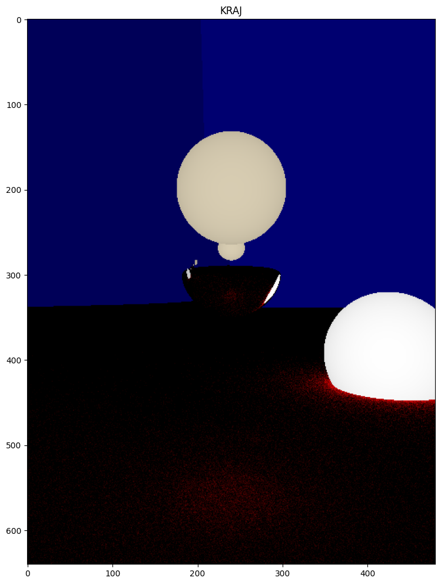
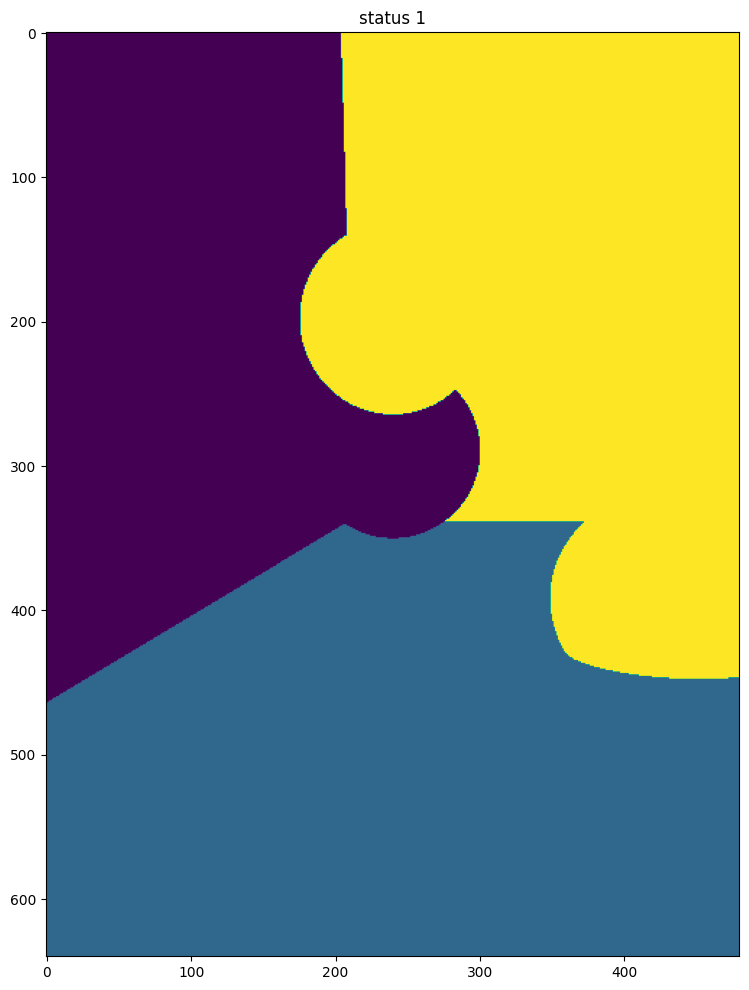
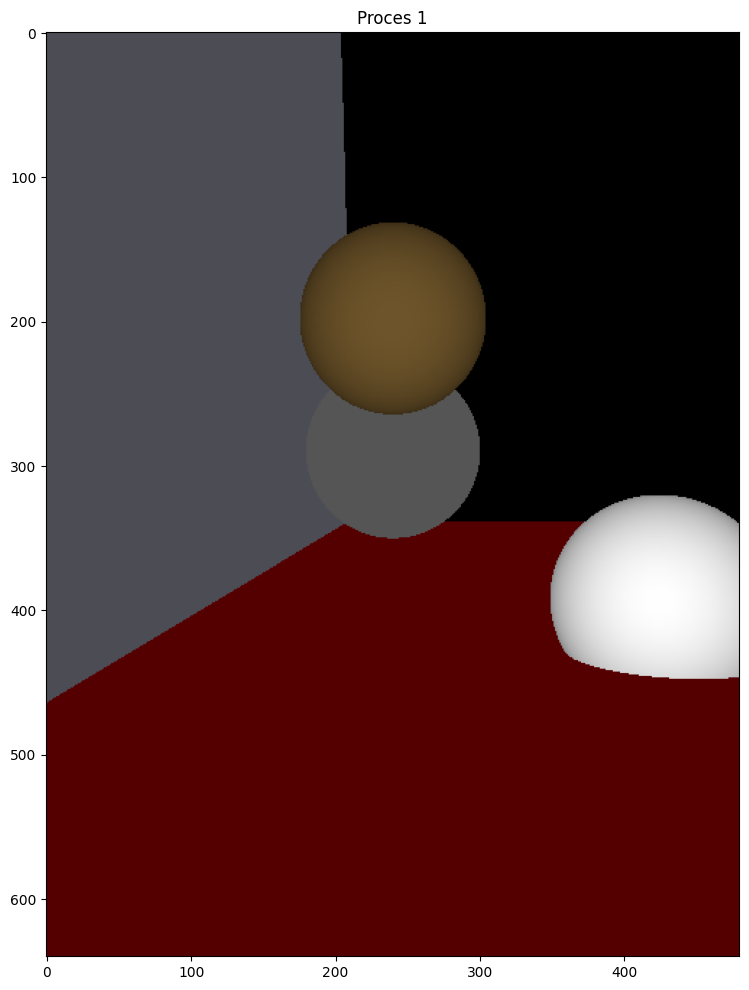
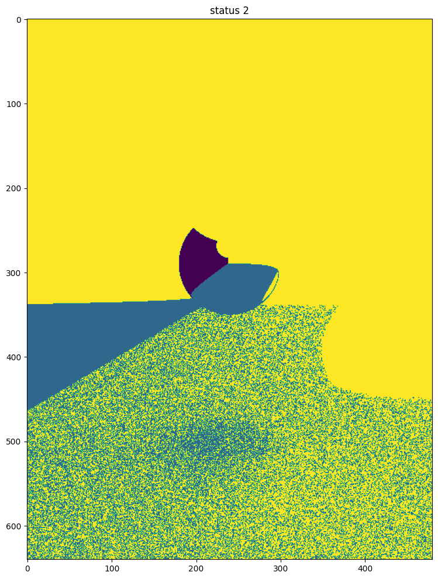
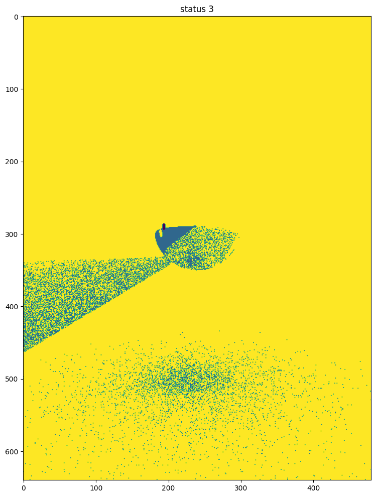
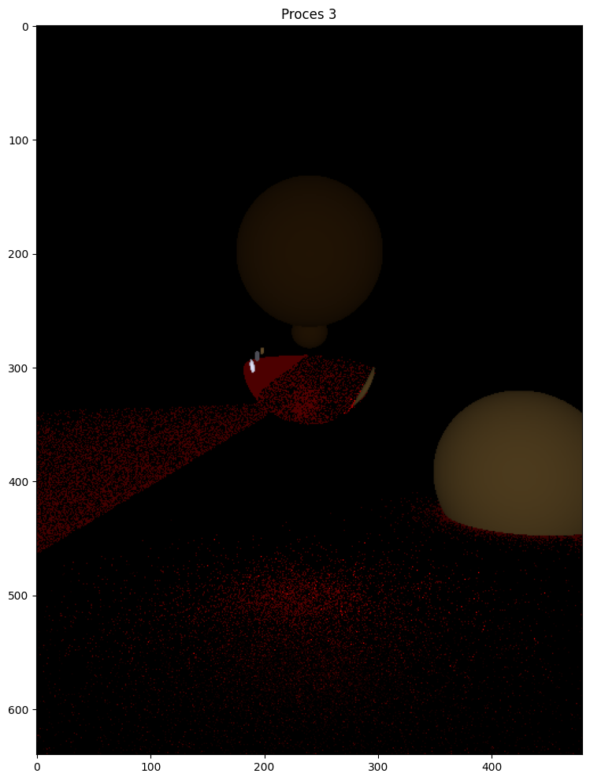
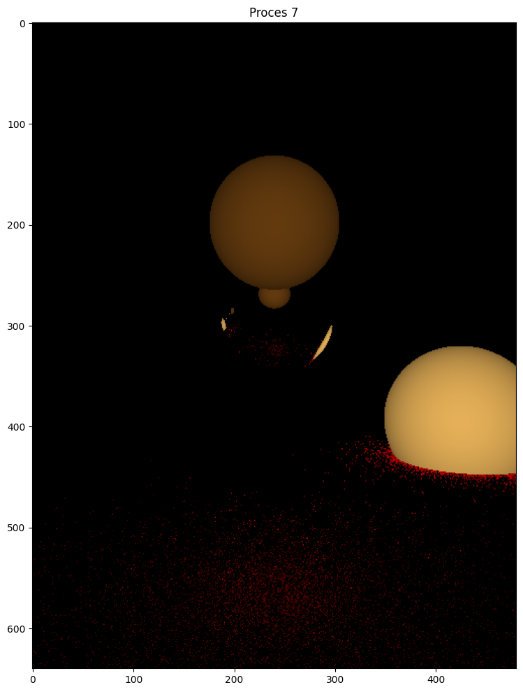
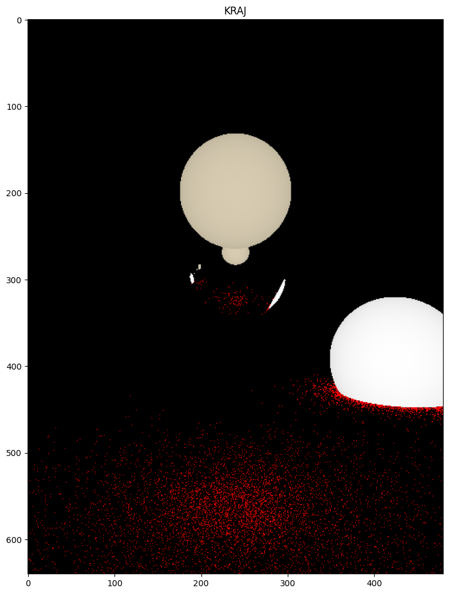

# pytorch-raytracing
Ray tracing written in Pytorch, which uses Nvidia GPUs through CUDA.

The Jupyter Notebook, and its previous versions, are available at https://www.kaggle.com/code/novakstijepic/fork-of-pytorch-ray-tracing .

## Table of Contents
* [Pytorch and CUDA](#chapter1)
* [Ray tracing](#chapter2)
* [Results](#chapter3)

# Pytorch and CUDA 

This project is meant to showcase how Python code can be sped up using CUDA. 

Usually, programs which require a lot of computation, like ray tracing, would be done in numpy. Functions in numpy are executed in C/C++, so this is more efficient than pure Python. However, numpy by itself does not enable you to use GPUs.

One way to deal with this is to use [torch.compile](https://pytorch.org/blog/compiling-numpy-code/). This is ideal if you already have numpy code which you want to speed up.

The other way is to write the code in PyTorch from the start - and this project shows how to do so. Firstly, the GPU should be specified as the device of every tensor. Secondly, autograd should be turned off, as it would needlessly calculate gradients for every tensor otherwise.

# Ray tracing 

The ray tracing engine itself is recursive - it tracks every ray in reverse as it bounces off walls and mirrors, and updates its color accordingly. The ray color is finalized when it hits a light source, the sky, or after 20 bounces.

However, when light sources are small in size, this approach is not ideal. Namely, in the real world, light reaches all parts of the surface of opaque, non-mirror objects (_matte_ objects), except for parts in the shadow. The light is reflected in many directions according to a distribution function, of which a part reaches the camera. In contrast, the naive algorithm produces a discrete result for every pixel - the ray has a light source (after n bounces) or it doesn't. Furthermore, [Steven's power law](https://en.wikipedia.org/wiki/Stevens%27s_power_law) doesn't allow us to merely increase the resolution and hope that our human eyes will average it out over several pixels. Therefore, a better algorithm is needed.

Usually, better accuracy is achieved by averaging the amount of light across thousands of randomized runs. This works best on images with large light sources. However, if the radius of the main  light source is halved, the numbers of runs needed to achieve the same accuracy is _quadrupled_. A less computationally expensive approach is to bias the rays towards the light and weigh them accordingly. This project is designed to use a third, less invasive approach. Namely, all light sources are made bigger - for rays reflected off matte surfaces - and having them emit less light. This algorithm only needs a few runs to accurately measure the amount of light on every pixel.

# Ray tracing 

